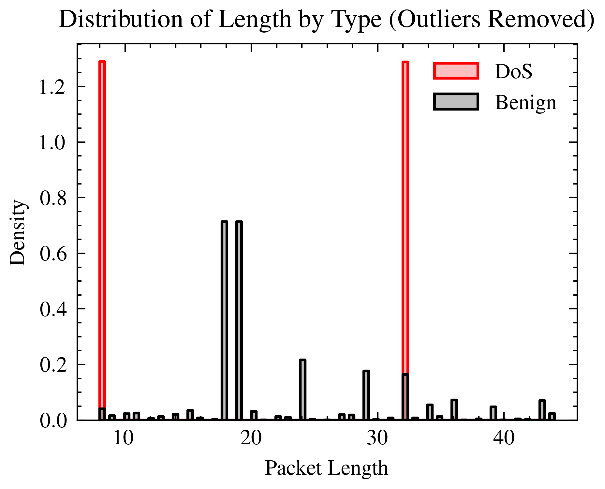
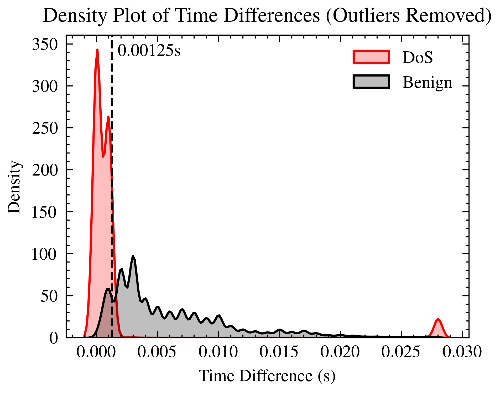
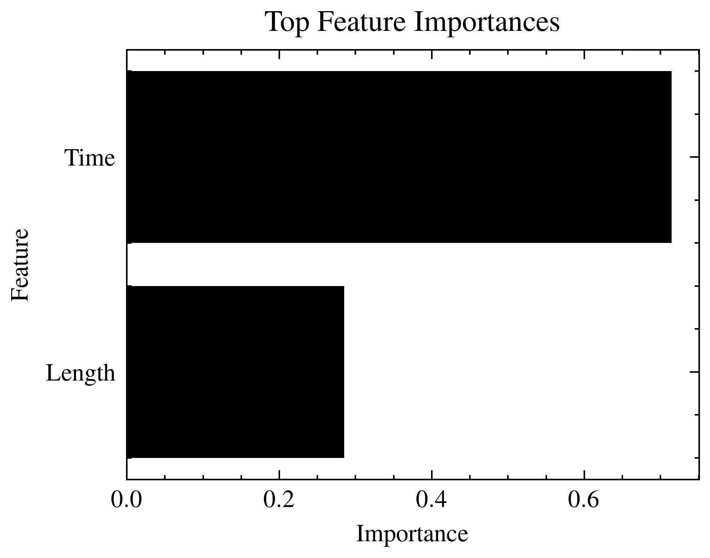
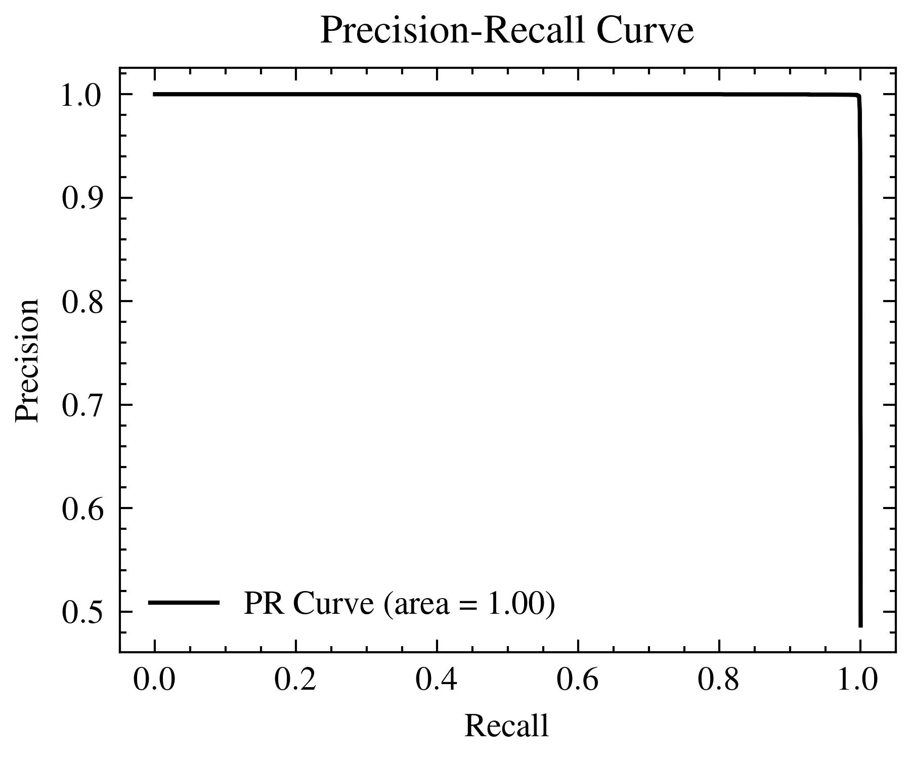
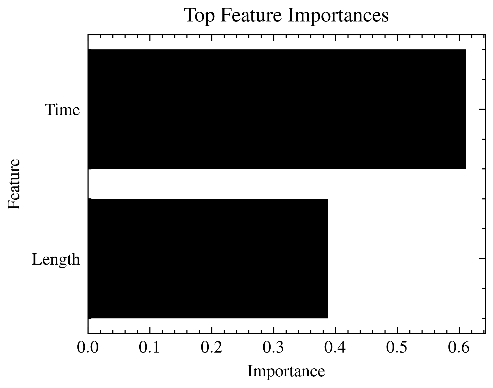
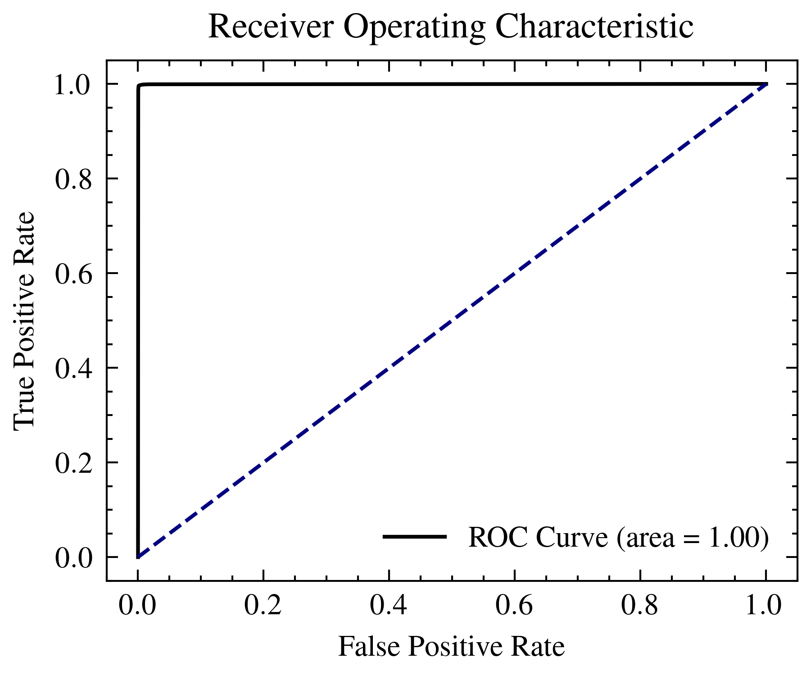

# Bluetooth DoS Classifier

Classifier of Bluetooth packets to detect DoS attacks.

## Prerequisites

- Python 3.12

## Usage

Run the following to clone the repository and setup the environment.

```sh
git clone https://github.com/mohdfareed/bluetooth-dos-classifier.git
cd bluetooth-dos-classifier
./setup.sh
```

Open the Jupyter notebook and select the environment `.venv` as the kernel.

## Dataset

The dataset is obtained from the following link:
https://www.unb.ca/cic/datasets/iomt-dataset-2024.html

The specific dataset used is the "Bluetooth" dataset. The dataset is in `.pcap`
format. The dataset is first converted to `.csv` format using the `tshark`
command line tool (WireShark can also be used).

The dataset above contain mostly attack data, with a relatively small amount of
benign data. Benign data was captured on macOS to balance the dataset using
[PacketLogger](https://www.bluetooth.com/blog/a-new-way-to-debug-iosbluetooth-applications/),
then it was exported to `.btsnoop` format and converted to `.csv` format using
`tshark` (or WireShark). The captured data is not included in the repository
due to its size, but is made available
[here](https://drive.google.com/file/d/1nPkZbiXhNc8zpFOwwX6NAAe4SncvrVb6/view?usp=sharing).

The data was captured with the following devices connected via Bluetooth:

- Headphones
- AirPods
- Mouse
- Game controller
- Smartwatch

The final project structure should be as follows:

```txt
project_root/
└── data/
    ├── benign_test.csv
    ├── benign_train.csv
    ├── capture.csv
    ├── dos_test.csv
    └── dos_train.csv
```

## Experiments

Each experiment done is run is a separate Jupyter notebook. The notebooks are
stored in the `notebooks` directory. An experiment's notebook outlines the
experiment's purpose and findings. The notebook contains the results of the
experiment through text and visualizations.

## Results

The following are the results of the experiments conducted.

### Feature Extraction

Feature extraction resulted in the following patterns:





Those two features, through experimentation, were found to be the most
discriminative features for the dataset.

### Gradient Boosting Machine

This model was found to be the best performing model, with a training time of
around 1 minute.

```txt
Test accuracy: 0.9979678844536394

Confusion matrix:
[[265024    463]
 [   588 251120]]

Classification report:
              precision    recall  f1-score   support

           0       1.00      1.00      1.00    265487
           1       1.00      1.00      1.00    251708

    accuracy                           1.00    517195
   macro avg       1.00      1.00      1.00    517195
weighted avg       1.00      1.00      1.00    517195
```






### Random Forest

This model was only slightly worse than the Gradient Boosting Machine model,
but training took significantly longer at 2.5 minutes.

```txt
Test accuracy: 0.9971287425439148

Confusion matrix:
[[264648    839]
 [   646 251062]]

Classification report:
              precision    recall  f1-score   support

           0       1.00      1.00      1.00    265487
           1       1.00      1.00      1.00    251708

    accuracy                           1.00    517195
   macro avg       1.00      1.00      1.00    517195
weighted avg       1.00      1.00      1.00    517195
```





